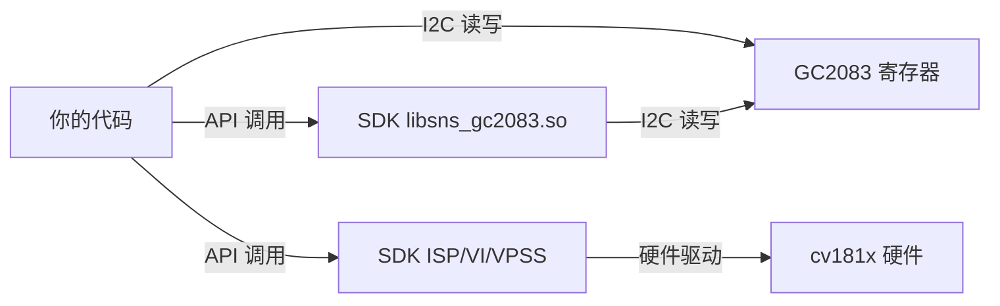

# GC2083 图像传感器控制学习文档

> Milk-V Duo (cv181x) + GC2083 MIPI 摄像头，从底层 I2C 寄存器到上层 SDK 采集的完整控制链路。

---

## 1. GC2083 传感器概况

| 参数 | 规格 |
|------|------|
| 光学尺寸 | 1/3.02 英寸 |
| 像素尺寸 | 2.7μm × 2.7μm |
| 有效像素 | 1920 × 1080 (1080P) |
| 快门类型 | Electronic Rolling Shutter |
| ADC | 10-bit |
| 最大帧率 | 30fps @ 全分辨率 |
| 接口 | MIPI 2-lane / DVP |
| I2C 地址 | **0x37** (ID_SEL=0) 或 0x7e (ID_SEL=0x6e 写/0x6f 读) |
| I2C 寄存器地址位宽 | 2 字节 |
| I2C 寄存器数据位宽 | 1 字节 |
| 电源 | AVDD28: 2.8V, DVDD12: 1.2V (内部 LDO), IOVDD: 1.8V |
| SNR | 37dB |
| 动态范围 | 74dB |
| 输入时钟 | 6~36MHz (典型 27MHz) |

### 框图（简化）

```
MCLK ──→ [Timing Control] ──→ [Row Decoder]
                                ↓
                           [Pixel Array 1928×1088]
                                ↓
                           [Column CDS]
                                ↓
                           [Analog Processing]
                                ↓
                           [10-bit ADC]
                                ↓
                           [ISP Block (片上)]
                                ↓         ↓
                         MIPI TX     DVP Parallel
```

GC2083 在芯片内部集成了一个简易 ISP（黑电平校准、坏点校正等），输出 **RAW10/RAW8 Bayer 格式**。

---

## 2. 硬件连接 (Milk-V Duo J1 MIPI 接口)

```
Pin  信号          方向       说明
────────────────────────────────────────
 2   MIPI0_DN0    输入       MIPI 数据通道 0 差分负
 3   MIPI0_DP0    输入       MIPI 数据通道 0 差分正
 5   MIPI0_DN1    输入       MIPI 数据通道 1 差分负
 6   MIPI0_DP1    输入       MIPI 数据通道 1 差分正
 8   MIPI0_CKN    输入       MIPI 时钟差分负
 9   MIPI0_CKP    输入       MIPI 时钟差分正
11   SENSOR_RSTN  输出(1.8V) Sensor 复位（低有效）
12   SENSOR_CLK   输出(1.8V) Sensor 主时钟 MCLK
13   I2C2_SCL     双向(1.8V) I2C 总线 2 时钟线
14   I2C2_SDA     双向(1.8V) I2C 总线 2 数据线
16   3V3          电源       传感器模拟供电
```

关键：所有信号电平 **1.8V**。I2C bus_id=2，GC2083 被挂载在 I2C-2 总线上。

---

## 3. GC2083 控制方式

### 3.1 控制接口：I2C 寄存器读写

GC2083 内部有一组 **16 位地址、8 位数据** 的寄存器，通过 I2C 总线读写。寄存器的作用是配置传感器工作模式和对 sensor 内 ISP 的参数进行设置（曝光、增益等）。

**I2C 时序（datasheet §7.1）：**

```
单寄存器写入:
S | 0x6E | A | RegAddr_H | A | RegAddr_L | A | Data | A | P

单寄存器读取:
S | 0x6E | A | RegAddr_H | A | RegAddr_L | A | S | 0x6F | A | Data | NA | P
```

**SDK 中的底层实现** (`gc2083_sensor_ctl.c`)：

```c
// 直接操作 Linux I2C 设备文件
int fd = open("/dev/i2c-2", O_RDWR);          // 打开 I2C 总线
ioctl(fd, I2C_SLAVE_FORCE, 0x37);             // 绑定从设备地址

// 写寄存器：发送 [addr_high, addr_low, data]
int gc2083_write_register(ViPipe, addr, data)
{
    buf[0] = (addr >> 8) & 0xFF;   // 地址高字节
    buf[1] = addr & 0xFF;           // 地址低字节
    buf[2] = data & 0xFF;           // 数据
    write(fd, buf, 3);
}

// 读寄存器：先写地址，再读数据
int gc2083_read_register(ViPipe, addr)
{
    buf[0] = (addr >> 8) & 0xFF;
    buf[1] = addr & 0xFF;
    write(fd, buf, 2);              // 发送寄存器地址
    read(fd, buf, 1);               // 读取数据
    return buf[0];
}
```

### 3.2 关键控制寄存器

这些是 SDK 驱动中用于控制曝光/增益/帧率的寄存器地址：

| 功能 | 寄存器地址 | 说明 |
|------|-----------|------|
| **曝光时间** | `0x0D03` (高), `0x0D04` (低) | 积分时间，以行数为单位 |
| **模拟增益** | `0x00D0` (低), `0x0155`~`0x0417` (放大级) | 多级增益控制，范围 1x~148x |
| **数字增益** | `0x00B1` (高), `0x00B2` (低) | 数字域放大 |
| **帧长度 (VTS)** | `0x0D41` (高), `0x0D42` (低) | 垂直总行数，控制帧率 |
| **芯片 ID** | `0x03F0` (高), `0x03F1` (低) | 读取应为 **0x2083** |
| **待机** | `0x003E`, `0x03F7`, `0x03F9`, `0x03FC` | 控制 sensor 待机/唤醒 |
| **镜像/翻转** | `0x0017` | bit0: 水平镜像, bit1: 垂直翻转 |

**帧率控制原理：**
```
帧率 = MCLK / (HTS × VTS)
       = 27MHz / (HTS × VTS)

VTS = 行总长度 (frame length, 寄存器 0x0D41/0x0D42)
HTS = 列总长度 (line length, 通常在初始化时设定)
```

通过改变 VTS 可以调节帧率。增大 VTS → 降低帧率，减小 VTS → 提高帧率（上限 30fps）。

### 3.3 上电时序（datasheet §9.2）

```
1. 给 AVDD28 (2.8V) 上电
2. 给 IOVDD (1.8V) 上电
3. 拉高 SENSOR_RSTN (复位释放)
4. 提供 MCLK (27MHz)
5. 等待 1ms 稳定
6. 通过 I2C 写入初始化寄存器序列
7. 传感器开始输出 MIPI 数据
```

下电时序相反：
```
1. 写待机寄存器 (0x003E=0x00, 0x03F9=0x41, ...)
2. 停止 MCLK
3. 拉低 RSTN
4. 断开 IOVDD
5. 断开 AVDD28
```

---

## 4. 数据通路：从 Sensor 到内存

### 4.1 cv181x 完整数据流水线

```
┌─────────┐   MIPI    ┌──────────┐   Bayer   ┌─────────┐   YUV   ┌──────────┐   NV12   ┌──────────┐
│ GC2083  │ ────────→ │  VI Dev  │ ────────→ │  ISP    │ ──────→ │ VI Chn   │ ────────→ │  VPSS    │
│ (Sensor)│  2-lane   │ (MIPI RX)│  RAW12    │ (cv181x)│  YUV420 │ (输出端口)│  bind    │ (缩放/格式)│
└─────────┘           └──────────┘           └─────────┘          └──────────┘          └──────────┘
                                                                                            ↓
                                                                                       CVI_SYS_Mmap
                                                                                            ↓
                                                                                      用户空间文件
```

**每一步的含义：**

| 步骤 | 组件 | 做什么 | 对应 API |
|------|------|--------|----------|
| 1 | Sensor | 输出 MIPI RAW10 Bayer | 无需软件控制（硬件配置后自动输出） |
| 2 | VI Dev | MIPI 物理层接收 | `CVI_VI_SetDevAttr` |
| 3 | VI Pipe | 接收 Bayer 帧，绑定 sensor 回调 | `CVI_VI_CreatePipe`, `CVI_VI_SetPipeAttr` |
| 4 | ISP | Bayer→YUV 转换、3A (AE/AWB/AF) | `CVI_ISP_Init`, `CVI_ISP_Run`（线程） |
| 5 | VI Chn | ISP 处理后的 YUV 输出端口 | `CVI_VI_SetChnAttr`, `CVI_VI_EnableChn` |
| 6 | VPSS | 缩放、格式转换 (YUV→NV12) | `CVI_VPSS_CreateGrp`, `CVI_VPSS_SetChnAttr` |
| 7 | 绑定 | VI→VPSS 自动传送帧 | `CVI_SYS_Bind` |
| 8 | 采集 | VPSS 通道取帧 + mmap 到用户空间 | `CVI_VPSS_GetChnFrame`, `CVI_SYS_Mmap` |

---

## 5. 是否必须使用官方 SDK？

### 简短回答：分层次

```
                    可以直接控制          需要 SDK
                    ───────────          ────────
I2C 读写传感器寄存器     ✅ 可以              —
Sensor 上下电/复位        ✅ 可以              —
MIPI CSI 接收            ❌                  必须
ISP Bayer→YUV 转换       ❌                  必须
3A (AE/AWB/AF) 算法      ❌                  必须
VPSS 缩放/格式转换        ❌                  必须
VB 内存池管理            ❌                  必须
```

### 详细解释

**你可以自己做的事情（绕过 SDK）：**

1. **直接读写 GC2083 寄存器** — I2C 是标准 Linux 接口
   ```c
   // 完全不需要 libsns_gc2083.so
   int fd = open("/dev/i2c-2", O_RDWR);
   ioctl(fd, I2C_SLAVE_FORCE, 0x37);
   // 自己写曝光、增益、镜像等寄存器
   ```

2. **控制 GPIO 复位** — 标准 Linux GPIO sysfs 或 libgpiod
3. **读取 MIPI 原始 Bayer 数据** — 但需要 SDK 配置 MIPI RX 硬件

**必须用 SDK 做的事情：**

1. **MIPI CSI-2 接收器配置** — cv181x 的 MIPI RX 是专用硬件，SDK 封装了寄存器操作
2. **ISP 流水线** — cv181x 的 ISP 是复杂的硬件模块，包含 Bayer 去马赛克、降噪、颜色校正、3A 统计等，不可能手写寄存器驱动
3. **VPSS 视频处理** — 硬件缩放/裁剪/格式转换
4. **VB (Video Buffer)** — 共享内存池管理，涉及 IOMMU 和物理地址映射

### 推荐方案



**使用 SDK 的 sensor 库负责初始化和 3A 同步**，但你可以随时通过自己的 I2C 代码**覆盖**特定寄存器（比如手动调整曝光）。

---

## 6. 实际控制示例

### 6.1 读取传感器 ID（检测 sensor 是否存在）

```c
#include <fcntl.h>
#include <unistd.h>
#include <sys/ioctl.h>
#include <linux/i2c-dev.h>

int fd = open("/dev/i2c-2", O_RDWR);
ioctl(fd, I2C_SLAVE_FORCE, 0x37);  // GC2083 地址

// 读寄存器 0x03F0 (CHIP_ID_H)
uint8_t buf[2] = {0x03, 0xF0};
write(fd, buf, 2);
read(fd, buf, 1);
int id_high = buf[0];  // 应为 0x20

// 读寄存器 0x03F1 (CHIP_ID_L)
buf[0] = 0x03; buf[1] = 0xF1;
write(fd, buf, 2);
read(fd, buf, 1);
int id_low = buf[0];   // 应为 0x83

int chip_id = (id_high << 8) | id_low;  // 应为 0x2083
printf("GC2083 ID: 0x%04X\n", chip_id);
```

### 6.2 控制镜像/翻转

```c
// 寄存器 0x0017: bit0=水平镜像, bit1=垂直翻转

// 正常
gc2083_write_register(vipipe, 0x0017, 0x00);

// 水平镜像
gc2083_write_register(vipipe, 0x0017, 0x01);

// 垂直翻转
gc2083_write_register(vipipe, 0x0017, 0x02);

// 镜像+翻转
gc2083_write_register(vipipe, 0x0017, 0x03);
```

### 6.3 调整帧率（修改 VTS）

```c
// 帧率 = MCLK / (HTS × VTS)
// VTS 寄存器: 0x0D41(高), 0x0D42(低)

// 设置 15fps（VTS 翻倍）
uint16_t vts = ORIGINAL_VTS * 2;  // 例如 2250 → 4500
gc2083_write_register(vipipe, 0x0D41, (vts >> 8) & 0xFF);
gc2083_write_register(vipipe, 0x0D42, vts & 0xFF);
```

### 6.4 手动控制曝光

```c
// 曝光寄存器: 0x0D03(高), 0x0D04(低)
// 单位：行数 (lines)

// 设置曝光为 1000 行
uint16_t exp = 1000;
gc2083_write_register(vipipe, 0x0D03, (exp >> 8) & 0xFF);
gc2083_write_register(vipipe, 0x0D04, exp & 0xFF);
```

### 6.5 手动控制增益

```c
// 模拟增益由多个寄存器级联控制
// 总增益 = (AGAIN_MAG1 / 1024) * (AGAIN_MAG4 / 1024) * ... * (B3 / 1024)
// 其中 B3 = (reg[0xD0] | (reg[0xDC1] << 8)) & 0x3FFF

// 设置 gain = 2x (2048/1024)
gc2083_write_register(vipipe, 0x0155, 0x08);   // AGAIN_MAG1 = 2048
gc2083_write_register(vipipe, 0x0412, 0x04);   // AGAIN_MAG4 = 1024
gc2083_write_register(vipipe, 0x00D0, 0x00);   // AGAIN_L = 0
gc2083_write_register(vipipe, 0x0DC1, 0x04);   // AGAIN_H = 4 (1024)

// 实际增益计算公式见 gc2083_cmos_param.h
```

---

## 7. SDK 初始化流程序列（完整参考）

这是我们 camera_app 验证通过的初始化顺序：

```
 1. CVI_VB_Init()                    ← 视频缓冲池
 2. CVI_SYS_Init()                   ← 系统初始化
 3. SENSOR: 读取 ID 0x2083 确认存在
 4. SENSOR: I2C 写入 ~500+ 寄存器初始化序列
 5. SENSOR: 注册 AE/AWB 回调 → pfnRegisterCallback
 6. CVI_VI_SetDevAttr()              ← VI 设备配置 (MIPI)
 7. CVI_MIPI_SetDevAttr()            ← MIPI 物理层
 8. CVI_VI_CreatePipe()              ← 创建 VI Pipe (Bayer 输入)
 9. CVI_VI_SetPipeAttr()             ← 设置 Pipe 属性
10. CVI_AE_Register()                ← 注册 AE 库 ("cvi_ae_lib")
11. CVI_AWB_Register()               ← 注册 AWB 库 ("cvi_awb_lib")
12. CVI_ISP_SetBindAttr()            ← 绑定 AE/AWB 到 ISP
13. CVI_ISP_MemInit()                ← ISP 内存分配
14. CVI_ISP_SetPubAttr()             ← ISP 公有属性
15. CVI_ISP_Init()                   ← ISP 初始化
16. pthread_create(CVI_ISP_Run)      ← ISP 线程 (阻塞调用)
17. CVI_VI_SetChnAttr()              ← VI Channel 属性
18. CVI_VI_EnableChn()               ← 使能 VI Channel
19. CVI_VPSS_CreateGrp()             ← 创建 VPSS Group
20. CVI_VPSS_SetChnAttr()            ← VPSS Channel 属性
21. CVI_VPSS_EnableChn()             ← 使能 VPSS Channel
22. CVI_SYS_Bind(VI_Chn, VPSS_Grp)  ← VI→VPSS 绑定
23. 循环: CVI_VPSS_GetChnFrame()    ← 取帧
24.       CVI_SYS_Mmap()             ← 映射物理内存
25.       CVI_SYS_IonInvalidateCache() ← 刷新缓存
26.       fwrite()                   ← 写文件
27.       CVI_SYS_Munmap()           ← 解除映射
28.       CVI_VPSS_ReleaseChnFrame() ← 释放帧
```

### 最容易出错的 4 个点

1. **VI Pipe ≠ VI Channel** — Pipe 是 Bayer 输入端，Channel 是 YUV 输出端，两者都要创建
2. **AE/AWB 库名** — 必须为 `"cvi_ae_lib"` / `"cvi_awb_lib"`，不能简写
3. **CVI_ISP_Run 必须在独立线程** — 这是阻塞调用，不放线程会卡死主循环
4. **帧数据访问必须 mmap** — `u64PhyAddr` 是物理地址，用户空间必须映射 + 刷新缓存

---

## 8. 参考文件

| 文件 | 位置 |
|------|------|
| GC2083 Datasheet | `~/duo/Learn_MilkV_DUOS/GC2083 CSP Datasheet Release Preliminary V0.0.pdf` |
| Sensor 驱动 (cv181x) | `~/sdk/.../cvi_mpi/component/isp/sensor/cv181x/gcore_gc2083/gc2083_cmos.c` |
| Sensor I2C 控制 | `~/sdk/.../cvi_mpi/component/isp/sensor/cv181x/gcore_gc2083/gc2083_sensor_ctl.c` |
| Sensor 寄存器定义 | `~/sdk/.../cvi_mpi/component/isp/sensor/cv181x/gcore_gc2083/gc2083_cmos_ex.h` |
| 寄存器参数表 | `~/sdk/.../cvi_mpi/component/isp/sensor/cv181x/gcore_gc2083/gc2083_cmos_param.h` |
| 我们的采集程序 | `~/duo/Learn_MilkV_DUOS/apps/usermode/camera_app/camera_app.c` |
| ISP 开发手册 | `ISP_Reference.txt` (已解压) |
